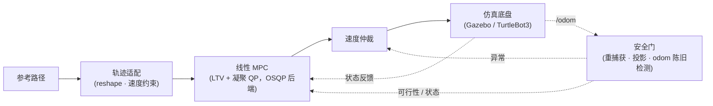

# linear_mpc_controller


面向差速移动机器人的线性时变 MPC 跟踪控制器，提供 Python 参考实现与 C++/Eigen/OSQP 实现。重点研究折返路径的投影错配、参考可行性与故障恢复，已开展离线测试及 ROS 2/Gazebo 独立场景验证，**尚未完成实机验证**。

同套算法有意实现两遍：Python 参考核心（`mpc_core/`，numpy dense ADMM）是测试与基准的审计真相；C++/OSQP 核心（`include/` + `src/`，Eigen）是 ROS 2 节点链接的实时实现，每个 `ctest` 周期都会与 Python 版互相核对。

---

## 演示

下方动图是参考核心（Python / numpy ADMM，无噪声、理想速度跟踪）在 `circle R=2` 基准上的离线闭环回放：


> Python 参考核心的离线闭环演示，采用理想速度跟踪模型；**不是** Gazebo 录像或实机实验。Gazebo / TurtleBot3 仿真数字见 [关键结果](#关键结果)。

```bash
# 复现动图（无需 ROS 2）：
python tools/make_circle_demo.py
# 产物：results/demo_20260909/circle_closed_loop.{json,gif}
```

---

## 三个核心贡献

- **处理折返与邻近路径段的投影错配**：机器人沿折返/回环路径行驶时，邻近或重叠的路径段会让"当前应跟踪哪一段"产生歧义，直接投影会使误差基准与速度指令跳变。状态化投影门在段之间做一致性选择，把这类**几何投影错配**从跟踪误差中分离出来。这与"参考本身是否运动学可行"是两个不同问题——拒绝不可行参考属于下一条的工具链，不由投影门承担（行为由 C++/Python 跨语言对照与行为测试固定，见 [技术文档索引](#技术文档索引)）。
- **实现状态化接受门与重捕获**：NORMAL→SEEKING→PROBATION→NORMAL 的闭环恢复由同一接缝（`safety/qp_fail_monitor.hpp` + `safety/reacquire_command.hpp`）单源驱动，行为测试覆盖了"SEEKING 不跑 QP、PROBATION 真跑 QP 且连续失败有界退出、观察期时长与输出边界"。ROS-free 单元 + 真实 OSQP 行为测试 16/16 通过。
- **提供参考可行性检查与速度规划工具，并验证跨语言一致性**：`certify_reference`（运动学可行性）与 `speed_profile`（速度规划）作为工具，用于参考核心的**离线验证流程**；ROS 路径入口经 C++ 轨迹适配（reshape + 速度约束）接入，是否把完整认证流程接到入口由调用方保证。同一参考喂入 Python 与 C++ 两个核心，`projection_parity`、`projection_golden`、`window_tail_parity`、`adapter_speed_parity` 四组对照随 ctest 门逐记录核对（见 [快速复现](#快速复现)）。

---

## 架构

控制器本体是一条闭环反馈，不是直线：



- 主链：**参考路径 → 轨迹适配 → MPC → 速度仲裁 → 仿真底盘**，底盘状态（位置、速度、`/odom`）回灌到 MPC 与安全门。
- 安全门是另一条小回路，它把"投影 / 重捕获 / odom 陈旧检测"三类异常汇到一起仲裁，而不是每个异常独立降级。
- **Nav2 插件集成**（独立小图，不在主链上）：

  ```mermaid
  flowchart LR
    PLANNER["上层规划<br/>(sister repo)"] -. Nav2 plugin .-> THIS["linear_mpc_controller"]
    style THIS stroke-dasharray: 4 3
    style PLANNER stroke-dasharray: 4 3
  ```
  与姐妹仓库 `ros2_tunnel_explorer` 的端到端连接**未完成验证**（见 [已知限制](#已知限制)）。

---

## 关键结果

### 表 1：参考核心 4-track 基线
*条件：纯 MPC、无传感器噪声、无 ROS 2；理想速度跟踪。*

| track | 完成 | e_y_rms / m | e_y_p95 / m | e_y_max / m | e_psi_rms / rad | QP 失败 |
|---|---|---|---|---|---|---|
| straight | COMPLETED | 0.122 | 0.349 | 0.355 | 0.107 | 0 |
| circle (R=2) | COMPLETED | 0.055 | 0.160 | 0.248 | 0.058 | 0 |
| s_curve | COMPLETED | 0.073 | 0.229 | 0.255 | 0.069 | 0 |
| u_turn | COMPLETED | 0.090 | 0.248 | 0.255 | 0.083 | 0 |

命令：`python benchmark_tools/scripts/run_reference_benchmark.py --runs 1 --outdir outputs/bench_ref`。完整 5 跑档案（20/20 COMPLETED、QP 失败 0）：`results/ref_core_5run_baseline/benchmark_results.md`。

### 表 2：Gazebo / TurtleBot3 闭环烟测（circle）
*条件：WSL2 + ROS 2 Jazzy + colcon + Gazebo Harmonic，circle 跑道，90 s。*

| 指标 | 值 | 阈值 | 结果 |
|---|---|---|---|
| 行驶距离 / m | 21.77 | ≥ 3.0 | PASS |
| 横向误差中位 / mm | 8.9 | ≤ 300 | PASS |
| 横向误差 p95 / mm | 34.4 | — | observed |
| 在带内比例 | 1.000 | ≥ 0.85 | PASS |
| QP 非零迭代占比 | 2658 / 2658 | — | observed |

来源：`results/mpc_smoke_20260909/circle/tb3_smoke.json`（`v0.3.1-evidence` 标签）。SHA 钉死、可由 `bash scripts/tb3_smoke.sh` 复现。直线证据：`results/mpc_smoke_20260909/straight/`。

其余数字（C++ vs Python 逐记录对照、`feasibility_guard` 4 几何矩阵）按需在 [技术文档索引](#技术文档索引) 查阅。

---

## 快速复现

```bash
# 1) ROS-free Python（Windows / Linux，仅需 numpy + pyyaml + pytest）
python -m pytest mpc_core trajectory_tools benchmark_tools test -q
python benchmark_tools/scripts/run_reference_benchmark.py --runs 1 --outdir outputs/bench_ref
python tools/make_circle_demo.py        # → results/demo_20260909/circle_closed_loop.gif

# 2) WSL2 / ROS 2 Jazzy（colcon + OSQP）
cd ~/ros2_ws
colcon build --packages-select linear_mpc_controller
source install/setup.bash
ctest --test-dir build/linear_mpc_controller --output-on-failure
bash src/linear_mpc_controller/scripts/tb3_smoke.sh     # Gazebo circle 烟测
```

---

## 已知限制

- **未做实机验证**——所有数字均来自 WSL2 / Gazebo Harmonic 仿真；徽章反映 CI 状态而非硬件跑。
- **0.15 s 未建模执行器滞后**——在激进阈值下会卡死 MPC（见 `results/controller_compare/`）。当前版本未做在线滞后补偿，比较脚本与阈值留待下一轮。
- **轨迹服务器必须开环**——闭环参考（circle / u-turn `ref_end ≈ ref_start`）会让 `reference_complete` 在 cycle 0 触发，控制器无法起步。`tb3_smoke.sh` 已处理。
- **离线验证流程要求参考先通过可行门**——示例 250 点路径有 16 点超 `ω_max`；参考核心的离线验证先经 `certify_reference` + `speed_profile` 再喂入 MPC。ROS 路径入口经 C++ 轨迹适配施加速度约束，是否把完整认证流程接到入口由调用方保证。
- **Nav2 插件集成未与姐妹仓库端到端贯通**——`linear_mpc_controller` 独立验证；正式覆盖链用 Nav2 RotationShim + DWB（见姐妹仓库 [关键结果](https://github.com/yeezhouyi/ros2_tunnel_explorer#关键结果)）。
- **残差 RL 分支已冻结**，不属于公开声明（postmortem 与复活条件见 `docs/residual_rl_postmortem.md`）。

---

## 技术文档索引

> 首屏只要求读完以上。下面是工程档案，按"先用结论、过程可查"原则归档到 `docs/`。

| 文件 | 内容 |
|---|---|
| `docs/mpc_model_derivation.md` | Frenet 误差、解析线性化、ZOH、凝聚 QP、降级阶梯 |
| `docs/reference_feasibility_final.md` | A3 / A4 / A5 终态验收（签名路径） |
| `docs/baseline_audit.md` | v0.2.1 冻结基线 + G1–G9 缺口审计 |
| `docs/controller_compare.md` | 同底盘/参考/限幅下 MPC vs Pure Pursuit |
| `docs/final_closeout_20260909.md` | TB3 烟测收尾与开放问题 |
| `docs/ros2_interface_contract.md` | 话题 / 帧 / QoS / 完成 / 健康 / 单写者 |
| `docs/engineering_checklist.md` | 六项能力验收矩阵 |
| `docs/b6_demo.md` | B6 端到端录像（仿真） |
| `docs/deploy_guide.md` | 部署指南 |
| `docs/residual_rl_postmortem.md` | RL 分支冻结原因与复活条件 |

封板与归档标签：`v0.3.0-engineered` @ `d920f4c`（参考可行性收尾）、`v0.3.1-evidence` @ `fdc2405`（TB3 smoke circle 证据）。

公开数字一律指向姐妹仓库 `docs/seal_results.json` @ `v1.0.0-sealed`（`b162fc1`）作为单一来源。

---

## 仓库结构

```
mpc_core/                  ROS-free Python 参考核心（Frenet / 模型 / QP / MPC / 降级 / episode）
trajectory_tools/          参考轨迹生成 + 曲率 / 速度补全
benchmark_tools/           指标 + manifest + 离线基准脚本
mpc_rl_env/                冻结的 fast-env / SB3 适配器（保留但不属公开声明）
system_identification/     一阶滞后 + 延迟拟合（仅仿真）
include/ src/ test/        C++/Eigen 核心 + ctest（WSL2）
ros2/ launch/ config/ worlds/ maps/    ROS 2 骨架（适配器 / 仲裁器 / Nav2 插件）
tools/                     跨语言对照 + 演示动图生成器 + dump 工具
docs/                      模型 / 可行性 / 控制器对比 / 工程审计（见上）
results/                   参考核心档案、烟测、动图、归档 diff
```

---

## License

Apache-2.0