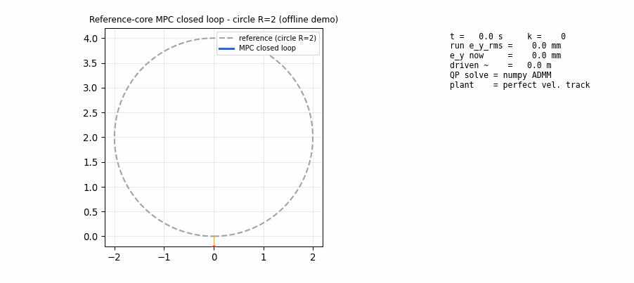

# linear_mpc_controller

**A linear time-varying MPC trajectory-tracking controller for differential-drive
robots, with the safety filter, projection gate, and Nav2 plugin glue needed to
run it on real ROS 2 hardware.** The package provides the same controller as a
ROS-free Python reference core (for offline analysis and tests) and as a
C++/Eigen/OSQP production node (for the real-time path on `/cmd_vel`).

In the broader two-repo stack (`linear_mpc_controller` + `ros2_tunnel_explorer`),
this package owns the *low-level tracking* layer: any planner that emits a
Frenet-friendly path (our tunnel explorer, or external) feeds through
`Trajectory Adapter → Linear MPC (+ safety projection) → Velocity Arbiter →
/cmd_vel`. Planning, frontier selection, coverage chains, and sealed result
tables live in the sister repo `ros2_tunnel_explorer`.

---

## Architecture

```mermaid
flowchart LR
    Plan["Path / plan<br/>(upper planner, e.g. tunnel explorer)"]
    TS["Trajectory Server<br/>(closed-loop ref stream)"]
    TA["Trajectory Adapter<br/>(reshape, certify, speed profile)"]
    MPC["Linear MPC<br/>(LTV + condensed QP, OSQP backend)"]
    Gate["Safety Gate<br/>(reacquire, projection, odom-staleness)"]
    VA["Velocity Arbiter<br/>(safety / nav2 arbitration)"]
    Cmd["/cmd_vel"]
    Robot["Differential-drive chassis<br/>(Gazebo / real)"]

    Plan --> TS --> TA --> MPC --> Gate --> VA --> Cmd --> Robot
```



The same algorithm exists twice on purpose: the Python reference core
(`mpc_core/`, numpy dense ADMM) is the audited source of truth used by tests,
the benchmark, and the closed-loop demo; the C++/OSQP core (`include/` + `src/`,
Eigen) is what the ROS 2 node links against and is cross-checked against the
Python one every `ctest` run.

---

## Demo

The clip below is the deterministic reference-core (Python / numpy ADMM, no
plant noise, perfect velocity tracking) running the formal `circle R=2`
benchmark and replaying the executed path against the reference. The
production numbers (Gazebo / TurtleBot3) and the raw replay live next to it
under `results/mpc_smoke_20260909/circle/` (`tb3_smoke.json`,
`REPRODUCE.md`, `SHA256SUMS`).



```bash
# Reproduce the clip locally (no ROS needed)
python tools/make_circle_demo.py
# Replays: tools/make_circle_demo.py → results/demo_20260909/circle_closed_loop.{json,gif}
```

---

## Conditional comparison tables

### 1. Reference-core 4-track baseline *(condition: pure MPC, no plant noise, no ROS)*

| track | done | e_y_rms | e_y_p95 | e_y_max | e_psi_rms | qp_fail |
|---|---|---|---|---|---|---|
| straight | COMPLETED | 0.122 | 0.349 | 0.355 | 0.107 | 0 |
| circle (R=2) | COMPLETED | 0.055 | 0.160 | 0.248 | 0.058 | 0 |
| s_curve | COMPLETED | 0.073 | 0.229 | 0.255 | 0.069 | 0 |
| u_turn | COMPLETED | 0.090 | 0.248 | 0.255 | 0.083 | 0 |

Command: `python benchmark_tools/scripts/run_reference_benchmark.py --runs 1 --outdir outputs/bench_ref`. Full 5-run archive (20/20 COMPLETED, QP fail = 0): `results/ref_core_5run_baseline/benchmark_results.md`.

### 2. Gazebo TurtleBot3 closed-loop smoke *(condition: WSL2 + ROS 2 Jazzy + colcon + Gazebo Harmonic, circle track, 90 s)*

| metric | value | threshold | result |
|---|---|---|---|
| driven distance | 21.77 m | ≥ 3.0 m | PASS |
| lateral error median | 8.9 mm | ≤ 0.3 m | PASS |
| lateral error p95 | 34.4 mm | — | observed |
| in-band fraction | 1.000 | ≥ 0.85 | PASS |
| QP cycles with non-zero iterations | 2658 / 2658 | — | observed |

Source: `results/mpc_smoke_20260909/circle/tb3_smoke.json` (`v0.3.1-evidence` tag). SHA-pinned and reproducible with `bash scripts/tb3_smoke.sh`; straight-track evidence in `results/mpc_smoke_20260909/straight/`.

### 3. C++ vs Python parity *(condition: colcon build, dump binary present in build tree)*

| test | records / asserts | result |
|---|---|---|
| `projection_parity` (straight+circle+fold) | 61 / 61 records agree | PASS |
| `projection_golden` (3 signed-in sequences) | 25 / 25 records agree, params identical | PASS |
| `window_tail_parity` (3 window bases × 8 steps) | OK | PASS |
| `adapter_speed_parity` (72 disc points) | max\|dκ\| = 2.97e-10, max\|dv\| = 2.29e-10 | PASS |

Full suite `ctest 13/13`, `pytest test_ros_contract.py 10/10`. The parity scripts
require their dump binary as `argv[1]` (CMake passes `$<TARGET_FILE:...>`), and
return `exit 1` (not `exit 0`) when the binary is missing or stale — verified
by deliberately renaming the dump during the fix.

### 4. Feasibility guard comparison *(condition: same path, raw reference vs. guarded reference, 4 geometries)*

| variant | max\|Δ progress\| | max\|Δ e_y_rms\| | max\|Δ QP fails\| |
|---|---|---|---|
| guarded vs raw reference (4 geometries) | 0.0009 | 0.0096 | 0 |

The guard rejects infeasible inputs with a reason code before they reach the
controller, instead of feeding them in and accepting the failure downstream.
Full cell matrix + reason codes: `results/feasibility_matrix/feasibility_matrix.json`.

---

## Reproduce

```bash
# 1) ROS-free Python (Windows / Linux, no extra deps beyond numpy + pyyaml + pytest)
python -m pytest mpc_core trajectory_tools benchmark_tools test -q
python benchmark_tools/scripts/run_reference_benchmark.py --runs 1 --outdir outputs/bench_ref
python tools/make_circle_demo.py          # → results/demo_20260909/circle_closed_loop.gif

# 2) WSL2 / ROS 2 Jazzy (colcon + OSQP)
cd ~/ros2_ws
colcon build --packages-select linear_mpc_controller
source install/setup.bash
ctest --test-dir build/linear_mpc_controller --output-on-failure
bash src/linear_mpc_controller/scripts/tb3_smoke.sh   # Gazebo circle smoke
```

---

## Known limits

- **Reference-core clip is offline**: the demo GIF is a deterministic
  reference-core replay, not Gazebo; the Gazebo numbers live in
  `results/mpc_smoke_20260909/circle/tb3_smoke.json`.
- **0.15 s un-modelled actuator lag** stalls the MPC under aggressive
  thresholds (see `results/controller_compare/`).`  No online lag
  compensation is wired in this revision — the comparison script and the
  acceptance thresholds are documented for the next round.
- **Trajectory server must emit an open loop**: a closed-loop `ref_end ≈
  ref_start` (circle / u-turn) makes `reference_complete` fire on cycle 0 and
  the controller never starts moving. `tb3_smoke.sh` already accounts for this.
- **No hard-realtime claim**: all results are WSL2 / Gazebo Harmonic sim.
- **No full raw-record pass on the production acceptance set**: the
  pre-guard raw reference fails (250-waypoint plan, 16 over `ω_max`); any
  reference must first pass `certify_reference` + `speed_profile`.
- **Residual RL branch is frozen** and not part of the public claim
  (postmortem + resurrection criteria in `docs/residual_rl_postmortem.md`).

---

## Sealed references and engineering archive

> The first screen above is the only thing new readers are expected to read.
> Everything below is engineering archive: process stage numbers, tag
> pinboards, and cross-repo result pointers preserved for accountability.

### Sealed / archived tags on this repo

- **Canonical**: `v0.3.0-engineered` @ `d920f4c` (2026-09-09 reference-feasibility close-out; the TB3 smoke `circle` evidence is sealed in `v0.3.1-evidence` @ `fdc2405`).
- **Historical evidence (kept, not part of the public claim)**:
  `cloud-seal-20260908`, `postseal-20260908`, `postseal2-20260909`,
  `archive-rescue-be39ffe`, `baseline-19317dfa`, `v1.0.0-sealed` (lightweight
  `@82b7a23`, supersede-not-replace marker before the heavy matrix was
  completed).

### Cross-repo result pointer (single source of truth)

All public numbers that show up in the resume or in the table above MUST be
sourced from `ros2_tunnel_explorer/docs/seal_results.json` @ `v1.0.0-sealed`
(`b162fc1`). Editing any number on this repo without re-rendering that JSON
is a seal-violation.

### Engineering audit trail (process records)

- `docs/baseline_audit.md` — frozen v0.2.1 baseline and the G1–G9 gap audit.
- `docs/mpc_model_derivation.md` — Frenet error, analytic linearisation, ZOH, condensed QP, fallback ladder.
- `docs/ros2_interface_contract.md` — topics / frames / QoS / completion / health / single-writer.
- `docs/engineering_checklist.md` — six-capability acceptance matrix.
- `docs/reference_feasibility_final.md` — A3/A4/A5 final acceptance (signed-in path).
- `docs/controller_compare.md` — MPC vs Pure Pursuit under the same plant / reference / limits.
- `docs/final_closeout_20260909.md` — TB3 smoke close-out and open issues (committed at `b0083ca`).
- `docs/residual_rl_postmortem.md` — why the RL branch is frozen and how it would come back.
- `docs/b6_demo.md`, `docs/deploy_guide.md` — integration / deployment notes.

### Result archives (machine-readable)

`results/ref_core_5run_baseline/`, `results/ref_core_baseline/`,
`results/a8_replay/` (12-cell matrix + rescue-vs-main diff vs
`archive-rescue-be39ffe`), `results/feasibility_matrix/`,
`results/feasibility_regress/`, `results/controller_compare/`,
`results/mpc_smoke_20260909/{circle,straight}/`,
`results/demo_20260909/circle_closed_loop.{json,gif}`,
`results/sysid_study/`, `results/attribution_study/`,
`results/eval_residual_c7_iter1/`, `results/eval_residual_c8_iter2/`,
`results/mpc_baseline_ros/`.

### 4060 / Day 10 sealed claims (moved here from the old README front page)

The Day 10 sealed-claim table (A5 stateful projection + acceptance gate,
12-cell ablation, kinematic-feasibility audit, cross-language golden, B6B
Nav2 plugin) and the 4060 acceptance table (A3 / A1 / A4 / U4 / sysid /
B4 bridge) are reproduced verbatim in
`docs/reference_feasibility_final.md` and `docs/final_closeout_20260909.md`
respectively. The on-page version of this repo intentionally does NOT carry
those tables — they are derived directly from the cross-repo seal JSON.

---

## Layout (one-screen reference)

```
mpc_core/                  ROS-free Python reference core (frenet / model / qp / mpc / fallback / episode)
trajectory_tools/          reference trajectory generators + curvature / speed completion
benchmark_tools/           metrics + manifest + offline benchmark harness
mpc_rl_env/                frozen fast-env / SB3 adapter (kept, not a claim)
system_identification/     1st-order lag + delay fit (sim only)
include/ src/ test/        C++/Eigen core + ctest (WSL2)
ros2/ launch/ config/ worlds/ maps/    ROS 2 skeleton (adapter / arbiter / nav2 plugin)
tools/                     cross-language parity + demo-clip generator + dump tools
docs/                      baseline_audit / mpc_model_derivation / ros2_interface_contract / engineering_checklist /
                           reference_feasibility_final / controller_compare / final_closeout /
                           b6_demo / deploy_guide / residual_rl_postmortem
results/                   reference-core archives, smoke, demo clip, archive diffs
```